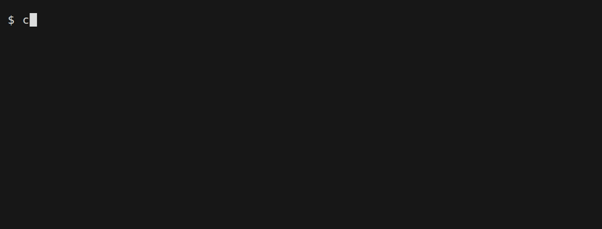
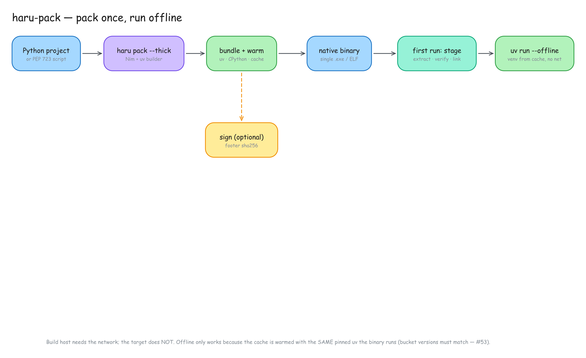
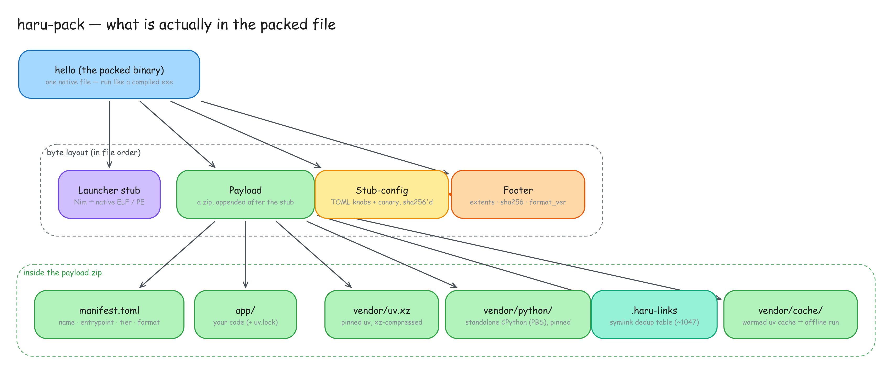
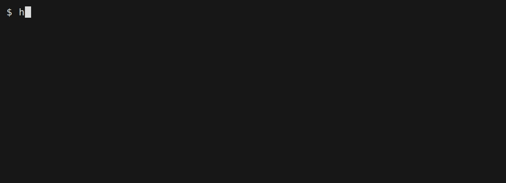

# haru-pack

<p align="center">
  
</p>

haru-pack (하루팩)

"Haru" (하루) means "day,"
"Pack" (팩) means "pack."

If you're shipping your code off on a little adventure you might send it with a ***day***...***pack***... get it?

you can just call it `haru` for short.

Pack a Python project — a **PEP 723 script** or a full **multi-folder project** (Flask,
Playwright, …) — into a single, **signable native launcher** that stages `uv` + a
standalone Python and runs it **as if it were a compiled binary in the folder it was
launched from**. Windows is a first-class target and a primary deployment goal, with
cross-compilation from Linux. Built on `uv`; launcher in Nim.

> Think PyInstaller's UX, but the interpreter + deps are delegated to `uv`, the launcher is
> a thin signable native stub, and you choose how much is bundled vs fetched on the target.
> 

## Why is this even here.

I love python.

I don't like most other programming languages... idk why, I'm lazy and stubborn.

You might find yourself asking "how is this even a modern Python project if it's not written primarily in a language other than Python?!? Where's the Rust?" and that is a fair set of questions.

idk if it is a modern Python project... there is no Rust at the top layer, anyway.

I do know that the ergonomics and sharp corners of other projects left me always a bit disappointed. I love Nuitka. I really love uv. I like pyinstaller. I also like Nimlang even though it's not python. (something about it appeals to me. that'll matter in a bit)

uv really changed how I approach python development. The way you use it made sense to me so there didn't feel like quite the cognitive barrier to get over. Just the simple venv helpers did a lot to help me maintain healthier projects. The fact that I could rapidly try new python versions without risking breaking something was awesome. I appreciated Anaconda for that but it was large and had this parallel ecosystem.

I saw uv and saw what I thought could be the future of sharing my code with others. They had figure out the "getting python on the computer problem". To be fair, pyinstaller was doing this over a decade ago. Nuitka as well. but they always felt "less-than" somehow.

I wanted a tool that could offer some degree of source protection and delivery while being "comfortable" for my smooth brain.

This is my attempt at also feeling "less-than". Made possible by AI. Thanks, Claude!

Now it's got far too many flags to remember but I don't need to remember them because my agent can just re-learn it for me anytime I need to know.

## AI Disclaimer

This project was engineered with AI but that doesn't necessarily mean it's slop. Care was taken to ensure that it's robust, built with consistent standards, and able to withstand some adversarial pressure. That being said, it might also be slop. Buyer beware. I believe we should be building tools that will outlast the AI bubble. Build the tools that will continue to work when we can no longer afford to throw tokens at the problem. I'm capitalizing on that now and building the tools using AI while I still have access to it. Come with me if you want to live.

## TL;DR

```sh
uv tool install haru-pack
haru bootstrap               # installs Nim via choosenim
haru yourscript.py           # -> ./yourscript, a single native binary
./yourscript
```



A real recording, not a mock-up — the tape that made it is `docs/tapes/`, and
`docs/tapes/record.sh` rebuilds every GIF here from a live build. The `file` line is the part
people do not believe: the output is an ordinary native ELF, not a self-extracting wrapper.
That build took ~20 s; the *first* one on a machine takes about two minutes longer, because
uv gets XZ-compressed once per uv version and cached (`reusing cached xz` is the recording
enjoying someone else having paid that).

`haru` and `haru-pack` are the same program. Point either at a script or a project directory
and one file appears — no Python needed on the target, runs from whatever folder it is in.

```sh
haru-pack ./myproject                              # project dir with a pyproject.toml
haru-pack ./myproject --thick                      # bundle everything, zero network at runtime
haru-pack ./myproject --target windows -o app.exe  # cross-compile from Linux
haru-pack ./myproject --target linux-aarch64       # Raspberry Pi
```



The build host needs the network; the target never does. The offline run works because the
cache is warmed with the **same pinned uv the binary runs** — see [`docs/TIERS.md`](docs/TIERS.md).

### default vs `--thick`

Both give you one file that needs no Python on the target. They differ in what is *inside* it,
and the choice is about what the target machine is allowed to reach — not about size.

| | bundled | first run | offline | sharing |
|---|---|---|---|---|
| **default** (~15 MB) | `uv` | downloads Python + your deps, then caches them | needs a network once | two of your apps share one copy of a heavy dep |
| **`--thick`** (~50 MB) | `uv` + Python + deps | nothing to fetch | **yes, always** | none — two thick torch apps are two copies |

Default is the right answer when your users are online: first launch costs a few seconds,
every launch after is instant. Reach for `--thick` when the target has no internet, or must
not depend on anything already installed on it. (`--thin`, ~0.4 MB, is the third option — it
bundles nothing and fetches uv too.) [`docs/TIERS.md`](docs/TIERS.md).

### What is actually in the file

Same shape at every tier: a real native executable, with a zip stapled to the end and a footer
that says where it is. The OS only ever executes the first part. Byte offsets below are the
`hello` binaries from the recording above — read them with `haru-pack verify <exe>`.



The exact bytes (from the `hello` binaries above):

```
  default (15,083,249 B)                       thick (50,425,885 B)
+--------------------------------+ 0        +--------------------------------+ 0
| Nim launcher                   |          | Nim launcher                   |
|   native ELF/PE, ~900 KB       |          |   byte-identical to default    |
|   the only part the OS runs    |          |   the only part the OS runs    |
+--------------------------------+ 907,952  +--------------------------------+ 907,952
| payload (zip)     14,175,076 B |          | payload (zip)     49,517,712 B |
|                                |          |                                |
|  app/           your code      |          |  app/           your code      |
|  manifest.toml  entrypoint,    |          |  manifest.toml  + offline=true |
|                 tier, cwd      |          |  vendor/uv.xz   uv, XZ'd       |
|  vendor/uv.xz   uv, XZ'd       |          |  vendor/python/ CPython: 95 MB |
|                 14.2 MB        |          |                 stored, 186 MB |
|                 + .sha256/.size|          |                 once staged *  |
|                                |          |  vendor/cache/  your deps **   |
|                                |          |  .haru-links    alias table *  |
+--------------------------------+          +--------------------------------+
| stub-config          105 B     |          | stub-config          105 B     |
|   cleartext knobs + canaries   |          |   cleartext knobs + canaries   |
+--------------------------------+          +--------------------------------+
| footer               116 B     |          | footer               116 B     |
+--------------------------------+ EOF      +--------------------------------+ EOF
```

\* python-build-standalone ships `bin/python`, `bin/python3`, `libpython3.13.so` and about a
thousand terminfo names as symlinks. Storing each one's target again cost 35 MB — 41% of the
binary — because a zip has no cross-member dedup, so the payload now stores each file once and
lists the 1047 aliases in `.haru-links`; the launcher re-creates them at stage time, which is
why the tree on disk is still the full 186 MB (`INV-PAYLOAD-06`).

\*\* `vendor/cache` is uv's cache for your dependencies, empty here because `hello.py` has
none — which is also why a thick `hello` is 50 MB rather than the hundreds a real project
reaches. The launcher is byte-identical between the two binaries: the tier changes only what
got stapled on.

The footer is `HARUPACK` … `KCAPURAH` around a payload offset, a length, and a SHA-256, found
by scanning **backward** from EOF so an Authenticode certificate appended after signing does
not hide it. The launcher checks that digest before it stages anything (`INV-LAUNCH-01`) —
though note it is not a MAC; see [Status](#status). `--encrypt` replaces the zip with an
AES-256-GCM container and sets a flag bit in the footer; nothing else about the shape changes.

Everything after the launcher is inert data, which is why the result signs like an ordinary
program. At run time the payload is unpacked into a content-addressed stage directory — not
next to the exe, and not into your cwd.

If a project declares more than one console script, haru-pack stops and asks rather than
guessing but you can also specify its entry-point:

```sh
haru-pack ./lotek --out lotek --entry-point "app.cli:main"
```

## Install

```sh
uv tool install haru-pack        # or:  pip install haru-pack / uvx haru-pack ...
haru-pack bootstrap              # Nim via choosenim + the pinned zig compiler
haru-pack init ./myproject       # optional: write a haru_pack.toml you can edit
```

`haru-pack doctor` tells you what the machine can actually build, and is the first thing to
run when a build fails for a reason that sounds like a toolchain:



`can build for` is the useful line. Anything under `not set up` is a target you can have,
with the command that installs it — cross-compiling needs that target's C toolchain on *this*
host, nothing on the target machine.

`bootstrap` installs Nim and a pinned `zig` (the default C compiler) into haru-pack's own
directory. No sudo, and your system Nim, `~/.nimble`, and system compilers are left alone —
so `uv tool install haru-pack && haru-pack bootstrap` is the whole setup (`INV-TOOL-02`).
The two are **not verified the same way**: the `zig` archive is checked against a digest
pinned in this repo, while for Nim the pin covers the `choosenim` *installer* — the compiler
it then fetches from nim-lang.org is verified by choosenim, not by us (`INV-SUPPLY-01`).

Opting out with `--cc system` is the only path that wants sudo; bootstrap works out what is
needed and shows you the exact command first. By default it installs **everything this host
can**, so you don't discover a missing cross-compiler three commands into a release. None of
it is compulsory (`INV-TOOL-01`):

```sh
haru-pack bootstrap                            # everything this host can install
haru-pack bootstrap --minimal                  # Nim only; zig arrives on first build
haru-pack bootstrap --target linux-aarch64     # exactly that, nothing else
haru-pack bootstrap --without wine             # everything except wine
haru-pack bootstrap --list                     # see what is available and what it costs
```

## Decisions

Short version of why this works the way it does.

**"User" means three people, and the third one wins.** Whoever works on haru-pack; the
developer running `haru-pack build`; and the person who receives the packed executable and
has never heard of uv or Python. The third gets no error message — only "it worked" or "it
didn't" — which is why everything below leans on refusing at build time rather than failing
on their machine. [`docs/PRINCIPLES.md`](docs/PRINCIPLES.md).

**uv does the Python part.** Interpreters, resolution, and virtualenvs are solved problems.
haru-pack stages a `uv` binary and gets out of the way.

**The launcher is Nim.** It has to be a real native executable Windows will let you
Authenticode-sign, and it has to cross-compile from Linux without a Windows machine. Nim
compiles to C and does both. It is ~2 400 lines of Nim across seven modules — staging and
verification is most of it, `main.nim` itself is under 400 — plus ~3 400 lines of vendored C
for the XZ decoder. Why not rewrite it in Zig, given a `zig cc` is already pinned? Costed and
declined in [`docs/COMMON_CRITIQUES.md`](docs/COMMON_CRITIQUES.md).

**Encryption protects the binary at rest; it cannot protect a secret from someone who runs
it.** The launcher stages the payload to disk in plaintext so the interpreter can run it, and
anyone who can run the binary can read that staged source from their own cache. `--obfuscate`
raises the *cost* of reading it; it is not a confidentiality boundary. A secret that must
never leak must never ship in an artifact the client holds — put it behind a server they
authenticate to. `INV-SECRET-02` / `INV-OBF-01`, and the busybody `reverse_engineer` persona
proves each edge rather than asserting it.

**One code path, not two.** Host and cross builds fetch the same artifacts the same way.
There used to be a "fast path" for the host; it was the *unverified* one, and it was the path
almost everyone took. `haru-pack bootstrap` installs Nim exactly one way (choosenim) — no
archive fallback, no source fallback. The one exception is the flex sandbox container image,
which needs `NIM_FROM` because choosenim publishes no linux-aarch64 binary; those fallbacks
are the image's and are not reachable from the CLI. [`docs/FLEX.md`](docs/FLEX.md).

**ARM Linux is a target; `bootstrap` will not make it a build host.** No choosenim binary
exists for it, so bootstrap on a bare arm64 box refuses and points you at an x86_64 machine
with `--target linux-aarch64`. You need no toolchain on the Pi to get a Pi binary. (Bring your
own Nim and haru-pack will use it — then it is yours to maintain.)

**Every artifact haru-pack fetches with its own downloader is pinned.** `uv`, the Python
interpreter, the `zig` toolchain, and the choosenim *installer* are each checked against a
SHA-256 in [`pins.toml`](src/haru_pack/pins.toml) before unpacking. No pin means the build
refuses; it does not fall back to trusting TLS.

Two things that does **not** cover, because haru-pack does not fetch them: the Nim compiler
itself (choosenim's business) and the PyPI sdists the flex harness pulls. And one it fetches
but does not control, which is the gap that matters because it ends up in every customer
binary: **the nimble libraries linked into the launcher are not pinned at link time.**
`bootstrap` installs `zippy`, `puppy`, `parsetoml` and `nimcrypto` at exact versions, but
`compile_launcher` then runs a bare `nim c` with no lockfile, no project `.nimble` and no
`--nimblePath` — so Nim links the *highest* version sitting in the package directory,
whatever that happens to be. Pinning the installer controls which versions arrive, not which
one gets compiled in. `INV-SUPPLY-02`, still `proposed`.

The one piece of third-party **source** in the launcher is handled differently again: the XZ
decoder is ~3 400 lines of C vendored from
[xz-embedded](https://github.com/tukaani-project/xz-embedded) (the decoder the Linux kernel
boots with), copied unmodified and reviewable in a diff rather than fetched at build time.
`python tools/verify-vendored-xz.py` re-downloads the pinned upstream tag and proves every
vendored byte matches it; a weekly workflow runs it, which is also how a *moved tag* would be
noticed. Each file's upstream path, the license, what was deliberately left out, and why this
is not the project that had the 2024 backdoor are in
[`PROVENANCE.md`](src/haru_pack/launcher/xz/PROVENANCE.md).

**Mirrors change where, never whether.** Point `[sources]` at a mirror if you cannot reach
github.com. The pin is chosen by the artifact's upstream identity *before* the URL is
rewritten, so a hostile mirror gets you a failed build, not a compromised one.

**The bundled uv is compressed, not packed.** uv ships XZ-compressed (55.59 → 14.17 MB, vs
22.25 deflated by the payload zip) — about 8 MB off every default and thick binary. The
launcher expands it at stage time and checks the result against the digest the build recorded,
so what runs is the publisher's own binary. That is exactly why this is not UPX, which would
rewrite the executable, destroy uv's signature, match no publisher digest, trip AV heuristics,
and pay the cost on every launch instead of once. [`docs/TIERS.md`](docs/TIERS.md).

**Thick can be shaken, on evidence, never on a guess.** `--shake` runs your test suite under a
file-access tracer, keeps the bundled files it touched, rebuilds from the pruned payload and
re-runs the suite — failing the build if that does not pass. Syscall-level rather than line
coverage, because the megabytes are in shared libraries `dlopen`ed from C extensions and in
data files, which coverage cannot see. A passing suite is evidence about the suite, not the
program, so this is opt-in and the receipt is the point. [`docs/SHAKE.md`](docs/SHAKE.md).

**It refuses instead of guessing.** Ambiguous entrypoint, missing digest, unknown target,
malformed `--entry-point` — all stop the build. A wrong guess compiles cleanly, exits 0, and
fails on the customer's machine, which is the worst place to find out.

**Claims are tested, not asserted.** [`INVARIANTS.md`](INVARIANTS.md) lists what must not
regress, each with a *red-path*: the exact edit that makes its test fail. CI enforces both
halves — that every `active` entry is claimed by a test, and that the claiming tests actually
run. A claiming test that **skips** fails the gate too, which is what makes a green run mean
something: a CI job with no Nim installed used to exit 0 with **fourteen** active invariants
whose every claiming test skipped — the payload-digest check itself (`INV-LAUNCH-01`) among
them. Measured, not estimated: hide Nim, run the claimants, count what never executed.
This exists because the first adversarial review found five documented, dated "Verified"
security claims here that were never implemented.

## Commands
| Command | What |
|---|---|
| `haru-pack init [dir]` | scaffold a `haru_pack.toml` (learns from pyproject + any venv) |
| `haru-pack build <dir>` | build a single-file launcher from a project or script |
| `haru-pack bootstrap` | install Nim + launcher deps; verify the C toolchain |
| `haru-pack doctor [dir]` | check Nim / C toolchain; scan a project for needed bundle/install steps |
| `haru-pack verify <exe> [--pin github:<user>]` | inspect the footer + confirm payload integrity; `--pin` also anchors a `--self-signed` build to a published identity ([`docs/SIGNING.md`](docs/SIGNING.md)) |
| `haru-pack hostname` | print this machine's OS hostname (for `--machine` license binding) |
| `haru-pack keygen` | mint + store the Ed25519 key for `--self-signed`, and print its fingerprint |
| `haru-pack version` | version |

## `build` flags
| Flag | Default | Meaning |
|---|---|---|
| `-o, --out PATH` | `<name>[.exe]` | output path |
| `-e, --entry-point SPEC` | discovered | what to run: `app.py`, a console script (`lotek`), or `module:callable` (`app.cli:main`) |
| `--target host\|<os>-<arch>` | `host` | e.g. `linux-aarch64` (Raspberry Pi), `windows-x86_64`, `macos-aarch64` |
| `--python X.Y` | auto | Python version to stage (else discovered from the project) |
| `--wine` | off | run execute-required bundle steps under wine (thick + `--target windows`) |
| `--tier thin\|default\|thick` | `default` | bundling tier (below) |
| `--thin` | | shortcut for `--tier thin` |
| `--thick` / `--chonky` | | shortcut for `--tier thick` |
| `--shake` | off | thick only: run the project's tests under a file tracer, drop bundled files nothing touched, and refuse to ship if the suite then fails ([`docs/SHAKE.md`](docs/SHAKE.md)) |
| `--shake-keep GLOB` | | never prune paths matching `GLOB` (repeatable) |
| `--encrypt` | off | AES-256-GCM encrypt the payload |
| `--secret TEXT` | | secret (key material) literal |
| `--secret-env VAR` | | read the secret from env var `VAR` at build |
| `--secret-prompt` | | prompt for the secret at build |
| `--embed-secret` | off | embed the secret in the exe (weakest; no runtime secret needed) |
| `--obfuscate ENGINE` | `none` | obfuscate the source before packing: `none` \| `pyarmor`. Independent of `--encrypt`; wants `--thick` |
| `--obfuscate-args "…"` | | extra args passed through to the obfuscation engine |
| `--expires YYYY-MM-DD` | | license expiry |
| `--machine HOST` | | bind to the target's OS hostname (`haru-pack hostname` on the target; FQDN with short-name fallback). Cryptographic — folded into the KDF |
| `--user NAME` | | bind to the OS login username (`getpwuid` / `GetUserNameW`, not `$USER`). Cryptographic, but SOME protection, not an identity check — see Status |
| `--geo CC,CC` | | allowed country codes |
| `--self-signed` | off | sign the build with an Ed25519 key so the launcher detects post-build edits (v3 footer). NOT tamper-evidence unless you publish/pin the fingerprint out of band ([`docs/SIGNING.md`](docs/SIGNING.md)) |
| `--sign-key PATH` | per-project keystore | Ed25519 key for `--self-signed`: a raw 32-byte seed or an OpenSSH `id_ed25519` (the embedded key can be your GitHub SSH key). Mint one with `haru-pack keygen` |
| `--sign-key-passphrase-env VAR` | | read an encrypted `--sign-key`'s passphrase from env var `VAR` (never prompts) |
| `--cert-file PATH` | | Windows only: request Authenticode signing (the real Windows tamper-evidence); haru-pack prints the exact `osslsigncode`/`jsign` command to run ([`docs/SIGNING.md`](docs/SIGNING.md)) |

`bootstrap` takes repeatable `--target`, plus `--yes` and `--force`. `doctor` takes `--target`.

## Tiers and cross-compiling

What each tier bundles is in [default vs `--thick`](#default-vs---thick) above; all three
cross-compile. Full detail, including the Playwright example: [`docs/TIERS.md`](docs/TIERS.md).

The one limit worth knowing up front: **thick cross-compile (Linux → Windows) works for
wheel-only projects.** `--target windows --thick` bundles a Windows standalone Python,
Windows uv, and Windows wheels, and the venv builds at first run on Windows from the bundled
cache — verified end-to-end under wine, offline. What cannot be produced cross is a
bundle/`post_install` step that must **execute target-native code** (`playwright install
firefox`, C/Rust source builds); build those on the target OS, under wine, or fetch the
binaries by URL.

## haru_pack.toml (optional declarations)
haru-pack discovers most things from your project. Add a `haru_pack.toml` at the project
root only to override or declare extras (full reference: [docs/CONFIG.md](docs/CONFIG.md)):
```toml
cwd_policy = "exe"               # "launch" (native cwd, default) | "exe" (always exe-adjacent)
entrypoint = ["python", "-m", "myapp"]   # override the discovered entrypoint
python = "3.13"                  # override the staged Python version (this is the default)

[encryption]                     # same fields as the --encrypt flags (secret via CLI/env only)
enabled = true
expires = "2027-01-01"
geo = ["US", "CA"]
```
Build-time bundling and OS-specific run-once hooks:
```toml
[[bundle]]                       # run at build, bake output into the exe (thick)
run = ["playwright", "install", "firefox"]
into = "vendor/ms-playwright"
[bundle.env]
PLAYWRIGHT_BROWSERS_PATH = "{into}"     # {into} -> stage dir at runtime
PLAYWRIGHT_SKIP_BROWSER_DOWNLOAD = "1"

[[post_install]]                 # run once on target; os-filtered by the compiled stager
os = ["windows"]
run = ["playwright", "install", "firefox"]
```

## Runtime environment (set for your code)
| Var | Meaning |
|---|---|
| `HARUPACK_EXE_DIR` | folder the shipped exe lives in (find config next to the exe) |
| `HARUPACK_STAGE` | the extraction/stage dir (bundled resources) |
| `HARU_SECRET` | (you set) license secret for an `--encrypt` build — default SECRET-knob canary; `--env-canary` / `--stub-env-secret-canary` change the prefix (INV-CANARY-01) |

`open("file.txt")` follows the process cwd like a native binary; use `cwd_policy = "exe"`
to make relative paths always resolve next to the shipped exe. Never use `__file__` for
user data — the code lives in the stage dir.

Easier to see than to read:


`cwd` is where the user ran the binary. `__file__` is inside the stage directory under a
content hash, and will be a different path after the next build. `HARUPACK_EXE_DIR` is the one
that answers "where is my config file". Code that reaches for `__file__` to find a data file
works in development and then ships broken.

## Docs

Read these two before relying on anything:

- [INVARIANTS.md](INVARIANTS.md) — what must not regress, each with a *red-path*: the exact
  edit that makes its test fail.
- [THREAT_MODEL.md](THREAT_MODEL.md) — assets, actors, trust boundaries, and what the
  licensing feature does and does not enforce.

Then, as you need them: [CONFIG.md](docs/CONFIG.md) (haru_pack.toml) ·
[TIERS.md](docs/TIERS.md) · [SIGNING.md](docs/SIGNING.md) (code signing + provenance: Ed25519 any-OS, Authenticode on Windows) ·
[ENCRYPTION_LICENSING.md](docs/ENCRYPTION_LICENSING.md) · [SHAKE.md](docs/SHAKE.md) ·
[SHARP_CORNERS.md](docs/SHARP_CORNERS.md) ·
[COMMON_CRITIQUES.md](docs/COMMON_CRITIQUES.md) (why Nim *and* zig, where's the Rust, why not
PyInstaller).

The rest of [`docs/`](docs/) is for people working *on* haru-pack — test harnesses, ADRs,
release process, and a couple of costed-and-declined designs kept so they are not
rediscovered from scratch.

## Status

Alpha. Core exercised on Linux (host + Windows cross-compile): run-in-place UX, CLI fidelity,
all three tiers, signable output, offline Playwright+Firefox, encryption + license checks.

**Read [THREAT_MODEL.md](THREAT_MODEL.md) before relying on `--encrypt` for anything
commercial.** The short version of what licensing does and does not enforce:

- **Machine and user binding are cryptographic, but they are not attestation.** The identity
  is folded into the KDF, so a wrong value never decrypts. It binds to what the target
  *reports*: `--machine` binds the OS hostname and `--user` the OS login username (via
  `getpwuid`/`GetUserNameW`, not `$USER`). That removes the trivial `USER=alice ./app` bypass,
  but it is still SOME protection, not an identity check — someone who controls the box can set
  a matching hostname or create a matching account. Tamper-evidence of the binary itself is a
  separate axis (`--self-signed` / `--cert-file`, see SIGNING.md).
- **`--expires` is not enforcement.** It reads the target's clock, after decryption, inside a
  binary they control.
- **`--geo` is a network call to a third party on every launch.** It resolves the caller's IP
  and country from online resolvers (default `https://ipwho.is/`, unaffiliated) and **fails
  closed**. So: every run sends your customer's IP to that service, and if the service dies
  or rate-limits, every geo-gated binary in the field stops running. It is an IP check, not a
  presence check — a VPN exiting in an allowed country passes.
- **The payload digest is not a MAC.** The launcher verifies it before staging
  ([`INV-LAUNCH-01`](INVARIANTS.md)), but it lives in the same footer an attacker would edit,
  so whoever modifies the payload can recompute it. Real tamper-evidence needs a signature
  ([`INV-LAUNCH-03`](INVARIANTS.md), not yet implemented) or Authenticode.

### Packing a tree you did not write is running it

`haru-pack build .` is not a read-only operation on your source. At `--thick` it resolves and
installs your project, which calls its build backend. A `[[bundle]]` step runs at build time
with your environment. A symlink is followed out of the tree. A `[tool.uv] index-url` in the
project decides where the wheels inside your signed binary came from.

That is all fine for your own repository and is how the features work. It is **not** fine for
a repo you cloned, a branch that arrived in CI, or an app an agent wrote that nobody read.
There is no boundary there today: `INV-TRUST-01` through `-07` are `proposed`, six of the
seven were demonstrated by the busybody `trojan` persona on 2026-09-11, and none are defended
yet. Treat packing an untrusted tree the way you would treat running its `setup.py` — because
you are.

## Prior art
haru-pack is not the first tool to stage `uv` from a native launcher.
[`ofek/pyapp`](https://github.com/ofek/pyapp) established the shape (and
[Hatch](https://hatch.pypa.io/latest/plugins/builder/binary/) builds on it);
[`PyCrucible`](https://github.com/razorblade23/PyCrucible) independently arrived at
embedding uv and extracting beside the executable; [`pex --scie`](https://docs.pex-tool.org/scie.html)
and the [a-scie](https://github.com/a-scie/lift) project named the eager/lazy bundling split
that our tiers rediscover. `research/05-uv-as-distribution-prior-art.md` credits the field
in full and records which ideas we borrowed from whom.
