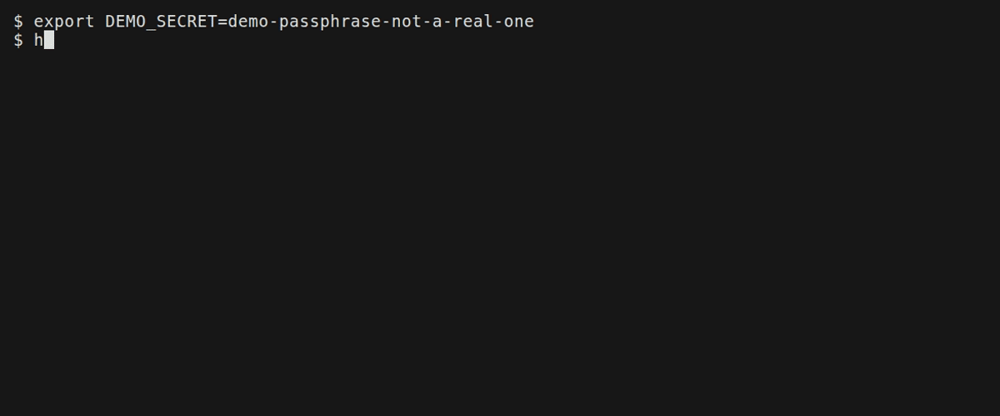

# haru-pack — encryption & license checks (implemented v1)

Opt-in `--encrypt`: AES-256-GCM payload encryption + license gating by expiry, machine,
user, and location. **No PKI / no certs** — the trust anchor is a secret you choose.

## Honest ceiling
Local execution means the machine must decrypt to run, so this **raises the bar against
casual copying and sharing** but is **not** unbreakable against a determined
reverse-engineer, and the gates below are **not enforcement**. Machine/user binding is
*cryptographic* (a wrong value derives a wrong key and nothing decrypts), though "user" is
weaker than it sounds — see part 2. Expiry is a clock comparison and location is an online
lookup made on the end user's own machine; both run after decryption, inside a binary the
licensee controls, so both can be patched out, while the policy itself cannot be edited
without breaking decryption. Read "Honest ceiling, part 2" and the location-gate section
below before any of this reaches a contract. For hard enforcement add a server.

## How it works (no PKI)
- Payload encrypted with **AES-256-GCM**. The license **policy JSON is inside the GCM
  plaintext**, prefixed by its length, ahead of the payload zip — so a reverse-engineer
  sees no expiry/geo/machine/user in the clear, and cannot edit them without the key.
  (`INV-CRYPTO-01`, `INV-CRYPTO-03`.)
  Earlier revisions of this document, and the header comment in `cryptbox.nim`, said the
  policy *was* the AAD. It never was. The tamper-evidence is real but comes from the
  policy being inside the ciphertext, not from the AAD — and a maintainer "correcting"
  the code to match the old wording would have moved the policy into the clear.
- **Container v2:** the AAD is every header byte before the ciphertext *except* the 16-byte
  tag field — `blob[0:44] + blob[60:62+esecret_len]`. Version, flags, KDF iterations, salt,
  nonce, `esecret_len` and the embedded secret are therefore **tamper-evident**: editing one
  is detected by the tag, not merely unproductive. The tag is elided because a GCM tag cannot
  authenticate itself. (`INV-CRYPTO-04`.)
  In **v1** the AAD was the bare magic, leaving the header outside the AEAD — fail-closed
  (a header edit changed key derivation, so the open failed) but not tamper-evident. A v2
  launcher **rejects a v1 container by version**, before prompting for a secret, so binaries
  built before this change must be rebuilt.
- Key = **PBKDF2-HMAC-SHA256(secret [+ hostname][+ login-user], random-per-build salt, 200k)**.
  The per-build salt makes the key **ephemeral**; machine/user binding is folded into the KDF
  so an unauthorized machine simply can't derive the key. The **machine** value is the OS
  **hostname** (FQDN preferred, short name on off-domain boxes), canonicalized IDENTICALLY on
  both the packer and the launcher — ASCII-lowercase, one trailing dot stripped — before the
  fold, so `WS1.CORP.` and `ws1.corp` bind the same host (`INV-BIND-01`). The **user** value is
  the OS **login username** (`getpwuid`/`GetUserNameW`), NOT `$USER`/`$USERNAME`. Because the
  match is exact, one differing byte fails closed — a binary bound to an FQDN will not open on a
  host that reports only the short name.

## Build
```sh
# secret sources (pick one). Prefer one that never lands in shell history:
haru-pack build ./app --encrypt --secret-prompt             --expires 2027-01-01
haru-pack build ./app --encrypt --secret-env LIC_SECRET     --geo US,CA
# bind cryptographically to a machine / user (get the hostname from the customer):
haru-pack build ./app --encrypt --secret-prompt --machine ws1.corp --user alice
# embed the secret in the exe (WEAKEST — no runtime secret needed):
haru-pack build ./app --encrypt --secret-prompt --embed-secret
```
End to end, with the right secret and then the wrong one:



The second run is the one worth watching. `wrong secret / not authorized for this machine /
tampered payload` names three causes in one message because the launcher cannot tell them
apart. The key is `PBKDF2-HMAC-SHA256(secret [+ hostname] [+ login-user], salt, iters)`, so a
wrong secret and — when machine binding is on — the wrong hostname both derive the wrong key,
and a wrong key and an edited payload both surface as the same GCM tag mismatch. There is one
`quit` after a constant-time tag compare in `cryptbox.nim`, and the message is the full extent
of what the code knows at that point, not a redaction of something it knows more precisely.
(This build is not machine-bound, so here the cause is the wrong passphrase.)

Note what the recording does **not** show, because it cannot: that a licensee who owns the
machine is kept out. They are not. Everything after the payload decrypts runs on hardware
they control, which is what the rest of this page is about — read "What this does not do"
below before you price anything on it. The passphrase on screen is a throwaway that exists
only in `docs/tapes/05-encrypt.tape`, and it is passed with `--secret-env` rather than
`--secret` for the reason in the next paragraph.

`--secret <literal>` also works and is the sharp edge: it puts key material in shell
history and in `ps` output for the life of the build. The invariant about what a build
emits (`INV-SECRET-03`: no secret in a manifest, receipt or kit) says so itself — "a
documented sharp edge, not a defended one". Use it for a throwaway test, not a release.

Get a target machine's hostname: `haru-pack hostname` (customer runs it, sends you the value).
It prints the SAME canonical form the launcher binds to, so what they send is what gets bound.

`--geo` / `--geo-restrict` build an **online** gate that calls a third party on every
launch of the resulting binary. Read the next section before shipping one. `--expires`
treats its date as inclusive, and the build-time validator is stricter than the launcher —
see "Expiry: the date is inclusive" below.

## Runtime secret resolution (precedence)
1. env `HARU_SECRET`  2. embedded (if `--embed-secret`)  3. interactive prompt (TTY).
`HARU_SECRET` is the SECRET knob's default canary (read as `<canary>_SECRET`); `--env-canary`
/ `--stub-env-secret-canary` change the prefix, and the retired `HARUPACK_SECRET` is no longer
read (INV-CANARY-01).
No environment variable *satisfies* the location gate any more: the `HARUPACK_GEO` bypass that
used to pass the geo check outright is gone, and the launcher reads no env var to decide location
(INV-CANARY-03, INV-GEO-01). That is a narrower claim than "no env var can defeat it", and the
difference is load-bearing. The gate is an HTTPS call made on the licensee's own machine, and
`https_proxy`, `SSL_CERT_FILE` / `SSL_CERT_DIR` and DNS/`/etc/hosts` are all theirs to set — so
they can point the resolver at something they run and forge an allowed answer. Raising the
consensus count does not help. See "The location gate calls a third party on every launch".

## Failure messages (exit codes)
Every launcher diagnostic is prefixed `haru-pack: `.
- expired → `license expired (DATE)` (3)
- location, too few resolvers answered → `cannot verify this machine's location — only N of
  M location checks completed, need K to agree (fail-closed)` (3)
- location, resolved and denied → `not licensed to run in this location` (3)
- location policy declared but unparseable → `location policy is present but unreadable —
  refusing to run (fail-closed)` (3)
- pre-Phase-4 array-form geo policy in an old build → `this build carries a retired
  geo-policy format; rebuild with a current haru-pack (INV-GEO-01)` (3)
- no secret available → prompt to set `HARU_SECRET` (or the build's chosen canary) (4)
- wrong secret / wrong machine / wrong user / tampered → single message (5)

## The location gate calls a third party on every launch

`--geo US,CA` and `--geo-restrict country_code=US,region=Texas` compile into an allow-policy
*inside* the encrypted blob, which `launcher/execgate.nim` evaluates on **every launch** by
making an HTTPS GET to a resolver that reports the caller's IP and geo. The default endpoint
is `https://ipwho.is/` (`execgate.nim:23`), a free service this project is not affiliated
with, called with a 15 s timeout. The gate passes only if at least K endpoints resolve *and*
at least K of those agree the caller is allowed; anything else quits with exit 3.

Earlier revisions of this document said offline geo read an env var and that online lookup
was "future work". Both statements are dead: the online gate shipped (ADR 0006,
`INV-GATE-01` / `INV-GEO-01`) and the `HARUPACK_GEO` bypass is gone from the launcher —
`tests/test_canary.py` scans every `launcher/*.nim` and fails on any `getEnv("HARU…")`
input literal outside its dev-only whitelist, naming `HARUPACK_GEO` if it comes back
(`INV-CANARY-03`). Any document still telling you to set `HARUPACK_GEO` is stale.

Three consequences to weigh before you turn the gate on, in roughly the order a customer
will raise them:

**1. Every launch discloses the end user's IP to an unaffiliated third party.** Their
address, and therefore their approximate location, reaches whoever operates that endpoint
each time they start your application. That is a privacy/DPA question the vendor gets asked,
and it is the vendor's to answer: you chose the gate, your binary makes the call, and the end
user has no way to see it in the clear. `--geo-restrict-api-url` can point at a resolver you
operate, which is the only way to keep that traffic inside a trust boundary you control.

**2. That endpoint's uptime becomes your application's uptime.** The gate fails closed by
design, so if the resolver rate-limits you (a free API, every one of your customers, possibly
one office IP), returns 500s, changes its JSON shape, or shuts down, **every geo-gated binary
you have shipped stops running** — and the fix is a rebuild and a redistribution, not a
config change on the target. An offline or air-gapped machine is the same case. Fail-closed
is the right choice for a gate; that does not make the availability dependency smaller.

**3. It is advisory against a determined local adversary, and consensus does not change
that.** The build-time advisory names one limit — this is an IP check, not a presence check,
so a VPN exit inside an allowed country passes. That is true and it is not the whole story.
The call is made *on the end user's own machine*, and a user with local privilege controls
their own proxy (`https_proxy`), CA trust (`SSL_CERT_FILE` / `SSL_CERT_DIR`), and name
resolution (`/etc/hosts`, DNS). They can point the resolver at something they run and hand
the gate `country_code=US`; **an `/etc/hosts` line defeats it**. Raising
`--geo-restrict-consensus` does not help, because one on-path position intercepts every
endpoint identically — consensus defends only against a minority of lying *external*
resolvers, never against the host. `INVARIANTS.md` marks this limit load-bearing ("do not
read the Statement wider than this"). The gate is real against a casual user and against
honest network faults; against a hostile host the durable control is not shipping to them.

What the gate genuinely fixed: the location decision is no longer local state haru-pack
trusts. Setting a *haru-pack* environment variable cannot turn a denied location into an allowed
one — that was `HARUPACK_GEO`, and it is gone. The env vars in the paragraph above are not
haru-pack's; they belong to the transport, and closing the honor-system knob did not close them.

## Honest ceiling, part 2: what the gates actually are

**Machine binding is cryptographic.** The key genuinely cannot be derived on a machine whose
hostname differs. `cryptbox.hostnameCanon` resolves the OS hostname (Windows
`GetComputerNameExW(DnsFullyQualified)` with a short-name fallback; POSIX/macOS `getHostname`)
and canonicalizes it exactly as the packer does before folding it into the KDF (`INV-BIND-01`).
Note that the hostname is a *value the target reports* — a writable string, not a hardware root
of trust — and the match is EXACT after canon, so a binary bound to an FQDN fails closed on a
host that reports only the short name. Use `haru-pack hostname` on the target to read the exact
value to bind.

**User binding is cryptographic in exactly the same sense and weaker in practice.** Earlier
revisions of this document hedged the machine case and left the user case bare, which made the
weaker of the two read as the solid one. As of #59 `cryptbox.loginUser` resolves the OS **login**
username (`getpwuid(getuid()).pw_name` on POSIX, `GetUserNameW` on Windows) — it is NO LONGER
`getEnv("USER")`, so the old `USER=alice ./app` one-liner no longer changes it. But it is still a
string tied to a login on a machine the licensee controls, so treat `--user` as a second
passphrase component, not as an identity check, and do not tell a customer it binds a licence to
a person. (On Windows, `GetUserNameW` under the NETWORK SERVICE account returns `<HOSTNAME>$`,
which is desktop-irrelevant but worth knowing before binding a service account.)

The other two are **not** controls in that sense:

- **Location** is an online gate (previous section): fail-closed, and with no haru-pack env
  knob that satisfies it — but advisory against a licensee with local privilege, who redirects
  the resolver with env vars of their own (`https_proxy`, `SSL_CERT_FILE`, `/etc/hosts`).
- **Expiry** compares against the local system clock, which the same person sets.

Both run after decryption, inside a binary the licensee controls, so both can also be patched
out. They are useful for keeping honest customers honest and for making accidental misuse
visible. Do not sell them as enforcement.

### Expiry: the date is inclusive, and the builder is stricter than the launcher

`cryptbox.nim:119` is `if now().utc > exp + initDuration(days = 1)`, so `--expires
2027-01-01` runs for the whole of 2027-01-01 UTC and refuses from 2027-01-02 00:00 UTC. The
date is inclusive; against the natural reading of "expires on that date" it is roughly a day
of grace. Nothing else in the tree said so.

The build side does not use that boundary. `validate_encryption` in `build/validate.py`
refuses any `--expires` whose date is already past, comparing *now* against that date at 00:00 UTC — so from
00:00:01 UTC on 2027-01-01, a build with `--expires 2027-01-01` is rejected as "in the past",
while a binary built the previous day with the same date keeps running for another 24 hours.
Neither side is wrong alone (the validator refuses to mint a licence that is already spent;
the launcher is generous about the last day), but they disagree by up to a day, and a
contract that names an exact cutoff should know which one it is quoting. Both compare in
UTC, so the moment a customer actually experiences depends on their offset, not on their
local midnight.

## Verified (2026-09-09, re-scoped 2026-09-15)

The original wording of this section asserted a list of manual observations, including
"Nim (nimcrypto) ↔ Python (`cryptography`) containers interop byte-for-byte", with no test
behind any of it. Nothing here re-checked itself, and one claim in the sibling
`docs/SIGNING.md` was false when written.

What is covered by executable tests today (`pytest -m invariant`):

| Claim | Evidence |
|---|---|
| Policy fields never appear in cleartext in a built container | `INV-CRYPTO-01` |
| Policy is recoverable after authenticated decryption, from inside the GCM plaintext | `INV-CRYPTO-01` |
| Machine/user bind to the OS hostname + login username, canonicalized identically on both sides, and fail closed on a mismatch | `INV-BIND-01` (source + a compiled cross-implementation canon vector + an execution parity matrix on Linux and on a Windows `.exe` under WINE) |
| Tampering with salt/nonce/tag/ciphertext/iters breaks the open | `INV-CRYPTO-03` |
| The Nim reader's byte offsets match the Python writer's | `INV-CRYPTO-02` (parses `cryptbox.nim`) |
| `--encrypt` actually encrypts | `INV-BUILD-02` |
| A build never reports encryption it did not apply | `INV-BUILD-01` |
| The location gate fails closed when the resolver denies, is unreachable, or consensus is unmet | `INV-GATE-01` (compiles and runs the launcher) |
| No haru-pack env knob *satisfies* the location gate: the `HARUPACK_GEO` bypass is gone and no launcher source reads a plain `HARU…` input | `INV-GEO-01`, `INV-CANARY-03` |
| **Not covered, and not claimed:** env vars the licensee owns (`https_proxy`, `SSL_CERT_FILE` / `SSL_CERT_DIR`, DNS) still *defeat* the gate by impersonating the resolver | nothing — `INV-GEO-01`'s "HONEST LIMIT" Note says so in as many words |

The machine-binding row now cites `INV-BIND-01`, which closes what earlier revisions of this
section flagged as an honest gap: until #59 no invariant's Statement covered deriving the key
from the machine value, the property was carried only by
`tests/test_container.py::test_wrong_machine_cannot_derive_the_key` (a test with no invariant,
mislabelled `INV-CRYPTO-03`), and nothing ran the Nim launcher's own reader — so nothing proved
the launcher resolved the *same* string the packager typed. `INV-BIND-01` proves exactly that
missing link: a compiled cross-implementation vector test pins the Python `canon_hostname` and
the Nim `canonHostname` to the same output, and an execution parity matrix builds
workstation1.corp-bound and notforworkstation1.corp-bound containers and runs the REAL compiled
Nim decryptor with the runtime hostname pinned — the matching binary opens, the other fails
closed — on Linux and on a cross-compiled Windows `.exe` under WINE. `test_wrong_machine_...`
remains as the narrow Python-KDF unit check.

`INV-CRYPTO-02` compares byte offsets parsed out of the Nim source against the Python writer,
which catches layout drift but is not itself an interop test. The interop test exists
separately: `tests/test_crypto_hardening.py` compiles `cryptbox.nim` and runs it in a
subprocess against containers written by `crypto.encrypt` — real AES-GCM open, header bytes
mutated one at a time, the no-echo prompt exercised over a pty. An earlier version of this
section said end-to-end decryption by the compiled Nim launcher was "not covered, and
deliberately not claimed"; that was written before those tests existed.

**The condition on that coverage matters, and CI now meets it.** Those tests (and
`tests/test_geo_gate.py`) do `shutil.which("nim")` and *skip* when it returns nothing, so they
prove nothing on a machine without a Nim toolchain. Until 2026-09-15 CI was such a machine and
this section told you so. It is not any more: `.github/workflows/ci.yml` has an `install nim`
step that runs `haru-pack bootstrap --minimal --yes`, resolves the compiler with
`bootstrap.find_nim()`, fails the job if none is findable, and appends its directory to
`$GITHUB_PATH`. `shutil.which("nim")` answers there, so these tests run and a green CI run **is**
interop evidence.

What stops that from silently reverting to the old state — where the same green tick meant the
tests had skipped — is `tests/_invariant_execution.py`: it fails the session when every selected
claimant of an *active* invariant skipped, and the workflow deliberately does not set
`HARUPACK_INVARIANT_SKIPS_OK`. If the bootstrap step breaks or is removed, the claims above that
are *wholly* nim-gated — `INV-GATE-01` and `INV-GEO-01`, whose every claimant compiles the
launcher — report as claimed-but-never-executed and the job goes red. `INV-CRYPTO-02` is **not**
in that set, and an earlier revision of this sentence listed it (and `INV-CRYPTO-04`, which is not
in the table at all) as though it were: three of its five claimants
(`tests/test_container.py::test_nim_reader_offsets_match_the_python_writer` and its two
neighbours) read `cryptbox.nim` as *text* and need no toolchain, and a fourth
(`test_crypto_hardening.py::test_nim_builds_the_same_aad_bytes`) does the same for the AAD. Only
the fifth, `test_nim_opens_a_python_written_v2_container`, compiles anything — so with no Nim it
skips, four source-parity claimants keep running, and the guard stays silent.
That is the first of two limits on the guard, and the reason to state both here: it judges an
invariant only when *all* of its selected claimants skipped, so one skipped test beside a sibling
that ran is invisible to it — exactly the case `INV-CRYPTO-02` is in, which is why the real
interop evidence rests on the `full suite` step, not on this guard. The second limit is that it
judges invariant claims, not the unmarked assertions in those files — those too are covered only
by the `full suite` step running green with Nim on PATH.
