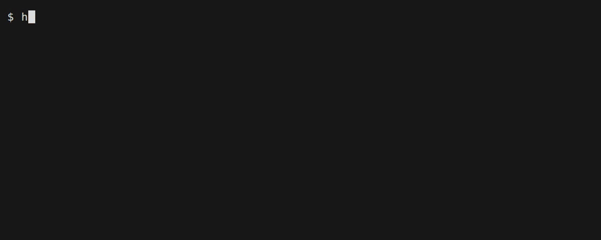

# haru-pack bundling tiers

How much is baked into the exe vs fetched on the target machine. Pick with a `build` flag.

| Tier | Flag | Bundled | Fetched on target | Size (hello) | Offline |
|------|------|---------|-------------------|--------------|---------|
| **thin** | `--thin` | nothing | uv + Python + deps | ~0.4 MB | no (needs net on 1st run) |
| **default** | *(none)* | uv | Python + deps | ~15 MB | no (net on 1st run) |
| **thick** | `--thick` / `--chonky` | uv + Python (+deps) | nothing | ~50 MB | **yes** |

> Measured, not derived: `hello` is **15.1 MB** at default tier and **50.4 MB** at thick
> (2026-09-15, linux-x86_64, Python 3.13). Thick was 85.4 MB until 2026-09-15, when
> `INV-PAYLOAD-06` stopped the payload storing python-build-standalone's interpreter
> symlinks as full copies — 35 MB of duplicate bytes, 41% of the binary. Both figures are a
> further ~8 MB down on where they started, because the bundled `uv` ships XZ-compressed;
> see below.

The same two builds, side by side, so the trade is a measurement rather than a table you have
to trust:



`ls -lh` prints MiB and rounds up, so the same thick binary reads as `49M` there and
**50.4 MB** here: it is 50,425,885 bytes, which is 50.4 MB and 48.09 MiB. The default binary
is 15,083,249 bytes (15.1 MB, 14.38 MiB, shown as `15M`). The `49517712 B` in the build
output is smaller than either because it counts the payload, not the whole executable.

Regenerate with `docs/tapes/record.sh 03`; the tape is `docs/tapes/03-tiers.tape`.

> **Invariant: uv is bundled in every tier except `thin`.** haru-pack never assumes the
> target machine already has uv — no supported Ubuntu LTS ships it, Debian has no CLI
> package (its ITP has been open since 2024 and only `python3-uv-build` landed), and NixOS
> documents uv's interpreter fetching as problematic. `thin` is the sole opt-out and it pays
> for that with a first-run download. Enforced in code by `tiers.bundles_uv()`, which is the
> single source of truth for both the bundler and the manifest's `fetch_uv` flag.
> Background: `research/05` §4.9.
>
> A thick tier needing no uv *at all* — shipping an installed dependency tree instead of a
> cache for uv to install from — was designed and costed on 2026-09-10 and **is not being
> pursued**. The reasoning, the measurements, and the finding that a prebuilt *venv* cannot
> be made to work cross-platform are in [`UV_FREE_THICK.md`](UV_FREE_THICK.md). Read that
> before reopening the question.

- **thin** — smallest artifact. On first run the launcher fetches the pinned uv release,
  then uv provisions Python + deps. The download is **one code path**: `puppy` (uses the
  OS-native TLS stack — **WinHTTP/Schannel** on Windows, **libcurl** on Linux/mac), so the
  target needs **no curl/wget/PowerShell** and the Windows exe carries **no openssl**.
  Archives extracted with `zippy` (zip + gzip'd tar) — no system `tar` either.
- **default** — the middle. uv is pre-bundled; Python + deps are resolved by uv on first
  run and cached in the stage dir. Good balance of size vs first-run speed.
- **thick** (a.k.a. **chonky** 🦣) — everything baked in: uv + a standalone Python
  (staged via `uv python install`) and, for projects, a prebuilt env. Downloads **nothing**
  at runtime (`UV_OFFLINE=1`). The launcher **discovers the bundled interpreter at runtime**
  (robust to uv's version-alias symlink dir, which the zip doesn't preserve).

## Stage-dir retention (eviction)
Each build stages to a new `<staging-root>/<key>-<payload-sha>` dir — so **every rebuild is a
new dir**. Without eviction those accumulate forever (23 MB default tier, 90 MB+ thick, per
version).

The launcher garbage-collects them. On every run it touches `.lastrun` in its own stage
dir, then deletes stage dirs that are **both** older than `keep_days` **and** outside the
`keep_max` most-recently-used. Defaults: `keep_days = 30`, `keep_max = 3`.

| Setting | Default | Meaning |
|---|---|---|
| `keep_days` | `30` | evict dirs unused this long; **`0` disables eviction** |
| `keep_max` | `3` | always retain this many most-recent dirs, whatever their age |

Set them in `haru_pack.toml`, or override per-machine with `HARUPACK_KEEP_DAYS` /
`HARUPACK_KEEP_MAX` (env wins; an unparseable value falls back to the manifest).

Safety rules, all covered by the eviction logic:
- The **live** stage dir is never evicted — it is touched *before* the sweep, so it stays
  current even if its previous markers were ancient.
- The sweep is scoped to the **siblings of the live stage dir** — the staging root the build
  actually used — so an `--ephemeral` / `BASE_PATH` build garbage-collects only its own trees
  and never reaches into the persistent cache.
- Only dirs carrying a `.ready` token are candidates, which excludes the sibling
  `uv-cache` tree and any half-written `<key>.tmp-<pid>` dir.
- Removal follows no symlink: the `.haru-links` aliases deduplicated on disk (INV-STAGE-04)
  are relative, in-tree symlinks, so deleting a stage dir unlinks them without ever touching a
  target outside the tree.
- Removal failures are swallowed and retried on a later run — on Windows a dir belonging
  to a concurrently running instance is locked, and that is the correct outcome.
- Eviction is skipped entirely under `HARUPACK_DEV_STAGE`.

**Residual risk:** an instance running continuously for longer than `keep_days` has a stale
`.lastrun` (it is touched at launch, not periodically), so a *different* launch could evict
the tree underneath it. Raise `keep_days` for long-lived services, or set it to `0`.


## Dependency caching: shared at default, none at thick (by design)

The tiers differ not only in what they *bundle* but in whether two of your apps can *share* a
big dependency on the user's disk.

- **default** keeps uv's caching win. The launcher points `UV_CACHE_DIR` at a per-user
  `~/.cache/uv-cache`, so the first run fetches a heavy dependency once and every later run —
  and every *other* default-tier app that needs the same version — reuses it, hardlinked, not
  downloaded again. Two of your apps that both depend on torch 2.x cost **one ~3 GB download
  and ~3 GB on disk**, not two.
- **thick** deliberately does the opposite. Its cache is `stageRoot/vendor/cache`, *inside*
  the binary's own verified, content-addressed stage, and `UV_OFFLINE=1` — so nothing is
  shared and nothing is fetched. That is the price of the offline contract: a thick binary is
  a sealed unit that runs on a machine with no network and no other haru-pack app present.
  Two thick torch apps are **~6 GB, and that is the point**, not a regression. (Re-running the
  *same* thick binary is still free — its stage is reused and re-verified, not rebuilt.)

Rule of thumb: **default** when your users are online and run several of your tools that share
heavy dependencies; **thick** when the target has no internet, or must not depend on anything
already installed on it. There is no knob today to make *thick* share one global cache across
binaries — that would reintroduce the network dependency thick exists to remove.

## Recipe: a licensed diagnostic that leaves little on disk — `--ephemeral --encrypt --obfuscate`

A licensed diagnostic tool whose *source itself* is sensitive — proprietary detection logic,
an embedded credential, a customer's data schema — should not be written to the user's disk in
the clear, even transiently. Combine these flags, each covering a different moment in the
binary's life:

- **`--encrypt`** keeps the payload AES-256-GCM encrypted **at rest** inside the binary, so the
  shipped file never contains readable source ([`ENCRYPTION_LICENSING.md`](ENCRYPTION_LICENSING.md)).
- **`--obfuscate`** (`pyarmor`) transforms the source itself, so the tree the launcher stages —
  even after decryption — is a pyarmor bootstrap plus an encrypted code object, not readable
  `.py`. A `grep` of the staged tree no longer yields the API key as a string literal, and the
  logic is not sitting there as source. This is the **slight anti-forensics** step: a dump of
  the RAM stage yields obfuscated code, not your program. See
  [obfuscation](SHARP_CORNERS.md) and `INV-OBF-01`.
- **`--ephemeral`** (renamed from `--ram-only`; wire key unchanged) stages the (encrypted-at-rest,
  obfuscated) tree to a RAM-backed root (`/dev/shm` on Linux) instead of the on-disk cache, so
  what is staged never touches persistent storage and is gone when the process exits. This is the
  **strongest** disk-hygiene control and it is truly RAM-only **only on Linux**: Windows/macOS
  have no unprivileged RAM disk, so there it is best-effort and falls back to disk with a note.
- **`--overwrite`** (optional; requires `--reap`) is belt-and-suspenders for the platforms where
  `--ephemeral` cannot keep the tree off disk: the detached reaper overwrites each staged file
  with matching-length random bytes and `fsync`s before unlinking, so a plaintext blob resists
  **simple** file-undelete. It is **not a secure erase** (SSD FTL, copy-on-write filesystems,
  snapshots/VSS and swap can retain the bytes — see [`THREAT_MODEL.md`](../THREAT_MODEL.md)); the
  durable defense remains `--encrypt` + `--ephemeral` (nothing plaintext ever reaches disk).
- **`--thin` vs `--thick`** — the size/reliability trade, and it interacts with `--obfuscate`
  (see the caveat): `--thin` ships a tiny file and fetches uv + Python + deps at run time;
  `--thick` bakes in the exact interpreter and runs offline.

**The honest boundary — do not bet your life on it.** Obfuscation raises the *cost* of reading
the staged source; it is **not a confidentiality boundary**. Whatever runs on the target must be
runnable, so it must be recoverable: a determined reverse engineer with the binary, a debugger
and time still wins — most casual rummaging does not. The rule the whole codebase holds to is
*a secret that must never be recovered must never be shipped to the client.* Likewise
`--ephemeral` governs only where the launcher stages *your payload tree*; it does not move uv's
dependency cache (the public PyPI packages `--thin` fetches land in the normal on-disk
`~/.cache/uv-cache` — not your secret), cannot control the application's own disk writes, and is
best-effort (no writable `/dev/shm` → it falls back to disk and says so). Anyone who can *run*
the binary can drive its recovered code. What you get is a realistic bar: your code is not
persisted to disk in the clear by default, and reading what *is* in RAM costs real effort.

**Caveat — obfuscation pins the exact Python minor.** pyarmor's runtime references
version-private CPython symbols, so a payload obfuscated for 3.12 imports **only** under 3.12.
Only `--thick` bundles that exact interpreter and guarantees the match; with `--thin`/default the
target resolves its own Python and the binary **fails to start** unless it happens to be exactly
that minor (haru-pack warns loudly at build time). So:

- target's Python is known/controlled → `--thin --ephemeral --encrypt --obfuscate` (smallest).
- target's Python is not guaranteed → `--thick --ephemeral --encrypt --obfuscate` (bundles the
  matching interpreter; larger, and offline, but it actually starts).

## The bundled uv is compressed, not packed
`uv` is the largest member of every non-thin payload, and the payload zip only has DEFLATE.
So it ships as `vendor/uv.xz` and the launcher expands it while staging. On uv 0.10.4
linux-x86_64: **55.59 MB raw → 22.25 MB deflated → 14.17 MB as XZ/LZMA2**, i.e. ~8 MB off
the finished binary. `INV-PAYLOAD-04`.

The staged `uv` is the publisher's binary, and two separate things make that true.
At build time `bundle_uv` verifies the release against the digest pinned in `pins.toml`
(`INV-SUPPLY-01`) and `compress_uv` compresses exactly those bytes. At stage time the
launcher expands the member and checks the result against the sha256 the build recorded
beside it, refusing the tree on a mismatch — measured digest `ae65ed04…` for uv 0.10.4
linux-x86_64 — and the expanded file is then recorded in `.stage-files` like every other
staged file.

Be precise about what the runtime check buys: it catches **corruption** — a truncated or
bit-rotted member, a mismatched size sidecar, a decoder bug. It does **not** defeat
tampering, because the digest sidecar sits next to the member an attacker would be
rewriting. The payload as a whole is covered by `INV-LAUNCH-01`, which has been `active`
since 2026-09-09: `main.launch` calls `verifyPayloadDigest` and refuses to stage or decrypt a
payload whose SHA-256 does not match its footer. That is a real check and it is not a MAC —
the digest lives in the same footer an attacker would be editing, so anyone who rewrites the
payload can recompute the 32 footer bytes and still execute. Tamper-*evidence* needs a
signature (`INV-LAUNCH-03`, still `proposed`) or Authenticode over the overlay on a signed
Windows build.

This paragraph said "byte-identical to Astral's release" full stop until 2026-09-11, with
nothing at runtime behind it; an adversarial review called that out and `INV-PAYLOAD-04`
was narrowed to match the code.

That identity is why this is compression of a payload member rather than UPX-packing
the executable:
packing modifies the binary, which destroys uv's own code signature, makes the shipped
bytes match no publisher digest, trips the AV packer heuristics that target UPX most of
all, and pays decompression on *every* launch instead of once.

Cost: ~2.7 s of one-time expansion during the first run's staging, and ~100 s of
compression on the *build* host the first time a given uv version is seen (cached under the
user cache dir afterwards, keyed by input digest and preset). Decoding uses xz-embedded's
`XZ_SINGLE` mode, which uses the output buffer as its own dictionary — so there is no 64 MB
dictionary allocation, which is what makes it fine on a Raspberry Pi.

Cross-platform: the decoder is ~3 400 lines of vendored, decoder-only C from
[xz-embedded](https://github.com/tukaani-project/xz-embedded) (the one the Linux kernel
uses to boot XZ kernels), with no dependencies beyond `memcpy`. Where it has been run:

| architecture | evidence |
|---|---|
| linux-x86_64 | compiles and round-trips the real `uv.xz` byte-identically (`ae65ed04…`) |
| windows-x86_64 | cross-compiled from Linux; same round-trip byte-identical under wine |
| **linux-aarch64** | compiled natively on an aarch64 Debian box (gcc 14.2, `-Wall -Wextra`, no warnings) and decoded the **real** `uv.xz` to the same digest `ae65ed04…`. The whole launcher also cross-builds with `aarch64-linux-gnu-gcc`, and that binary ran on an arm64 Pi with its expanded uv matching the recorded digest — 2026-09-11 |
| macOS | **not** compiled or run — no Mac and no osxcross here. The C is architecture-neutral and has no Darwin-specific paths, but that is reasoning, not a measurement |

Provenance and per-file digests: `src/haru_pack/launcher/xz/PROVENANCE.md`, enforced by
`INV-PAYLOAD-05`.

## What thick does NOT carry
The bundled dependency cache holds the project's **runtime** resolution only. `uv sync`
installs the default dependency groups — `dev` among them — so this used to warm the cache
with the project's own test runner and build backend and ship them inside the signed binary
(11 dists / 6.5 MB on `examples/shake-demo`). A launcher runs the entrypoint, never the
suite. Those tools are still installed at build time, into the throwaway build env, so a
`[[bundle]]` step or a `--shake` observation run can execute them — just not from the
payload. `INV-PAYLOAD-03`.

## Making thick smaller: `--shake`
`--thick` bundles the resolved dependency closure, which is always larger than the set of
files the program opens. `haru-pack build ./proj --thick --shake` runs the project's
declared test command under a file-access tracer, drops what nothing touched, then rebuilds
from the pruned payload offline and re-runs the suite — failing the build if it does not
pass (`INV-SHAKE-01`). Measured on `examples/shake-demo`: 92.1 → 75.9 MB payload — a figure
that predates `INV-PAYLOAD-03`, so the baseline is now smaller and the marginal saving less;
`SHAKE.md` carries the full caveat. The floor
is the bundled `uv` (~55 MB unpacked) plus CPython, so expect ~50-60 MB however hard you
shake; the big wins are projects whose dependencies dwarf that. Details, limits and the
config block: [`SHAKE.md`](SHAKE.md).

## Cross-compile notes (Linux → aarch64)
The launcher for `linux-aarch64` cross-compiles with the **default** compiler — the pinned
`zig` haru-pack installs into its own directory. No sudo, no system cross-gcc:

```sh
haru-pack bootstrap                          # installs zig (and Nim); covers every target
haru-pack build ./app -o app --target linux-aarch64
```

If you would rather use a cross toolchain already on the box, opt out per build with
`--cc system` (or `HARUPACK_CC=system`), and install it the old way:

```sh
haru-pack build ./app -o app --target linux-aarch64 --cc system
# needs: sudo apt install gcc-aarch64-linux-gnu
```

### why zig is the default compiler
`zig cc` is a cross-compiler in one download: it builds every target haru-pack ships for —
`linux-{x86_64,aarch64,armv7}` and `windows-x86_64` — with no system package and no sudo,
which is what makes `uv tool install haru-pack && haru-pack bootstrap` the whole setup.
`--cc system` remains for anyone who prefers their own toolchains, and is **required** for a
macOS target: zig's bundled macOS headers lack `fstore_t`, which Nim's posix module needs.

| target | bundled `zig` | note |
|---|---|---|
| `windows-x86_64` | builds a launcher (PE32+) | verified under wine |
| `linux-armv7` | builds a launcher (ARM EABI5) | |
| `linux-aarch64` | builds a launcher (ELF aarch64) | needs a one-flag shim: `nimcrypto`'s `sha2_neon.nim` passes `-march=armv8-a+crypto`, which zig's clang reads as a CPU name and rejects; the shim rewrites it to `-mcpu=baseline+aes+sha2`. The result's SHA-256 matches the GCC build byte for byte on real hardware |
| `macos-aarch64` | **not supported** | use `--cc system` with the real Apple SDK |

An earlier pass here concluded zig "was not worth it" — it answered the wrong question
("can zig replace the whole set outright, unmodified?"). Against the right one ("is one
bundled compiler more ergonomic than four system packages?") the answer is yes, with the
single shim above. The full record — pins, the shim, the byte-for-byte KAT on real arm64
hardware, and the macOS gap — is in [`ZIG_TOOLCHAIN.md`](ZIG_TOOLCHAIN.md). `INV-TOOL-02`.

## Cross-compile notes (Linux → Windows)
- **thin / default**: fully supported from Linux. `haru-pack` fetches the **Windows** uv
  release when `--target windows` (uv binaries are per-OS), and the launcher links WinHTTP
  for the runtime fetch — no openssl.
- **thick + `--target windows` from Linux**: **supported for wheel-only projects** (verified
  under wine, offline). haru-pack bundles a Windows standalone Python (python-build-standalone,
  via uv's catalog), Windows uv, and Windows wheels (`uv pip install --python-platform windows
  --only-binary :all:`); the venv builds at first run on Windows from the bundled cache.
  Bundle/`post_install` steps that must **execute** target-native code (`playwright install
  firefox`, C/Rust builds): pass **`--wine`** to run them under wine with the bundled Windows
  Python (verified: a step's output is baked into the Windows exe from Linux). The tool must
  run under wine — Playwright's Node driver is flaky under wine, so for Playwright build
  thick on Windows or use a `[[post_install]]` with `os=["windows"]` instead.

## Manifest fields set by the tier
`tier`, `offline`, `fetch_uv`; plus `uv_version` and `uv_sha256` on **thin**, where the
launcher fetches uv and checks it against that pinned digest before extracting it
(`INV-SUPPLY-05`). A `--shake` build also records a summary: `shaken`, `tracer`,
`dropped_files`, `freed_bytes`, `verified`. The interpreter for thick is auto-detected at
runtime, not pinned in the manifest.

## Example: bundled Playwright + Firefox (offline)
`examples/playwright-shot` — a project that screenshots a page with **Firefox**, built
fully offline with `--thick`:
```sh
haru-pack build examples/playwright-shot/payload --thick -o shot
./shot                      # extracts once, launches BUNDLED firefox, writes shot.png
```
Thick with `bundle_browsers: ["firefox"]` in the manifest makes `haru-pack`: stage a
standalone Python, warm a uv cache with the project deps (so the venv builds offline at
runtime), and run `playwright install firefox` into `vendor/ms-playwright`. At runtime the
launcher sets `PLAYWRIGHT_BROWSERS_PATH` into the stage + `PLAYWRIGHT_SKIP_BROWSER_DOWNLOAD=1`
— zero network. Verified: ~245 MB exe, produces a 1280×720 PNG with `PATH=/usr/bin` and no
network. (Headed Firefox on Linux needs GTK/X libs; headless is self-contained. Cross to
Windows: build `--thick` on Windows.)
